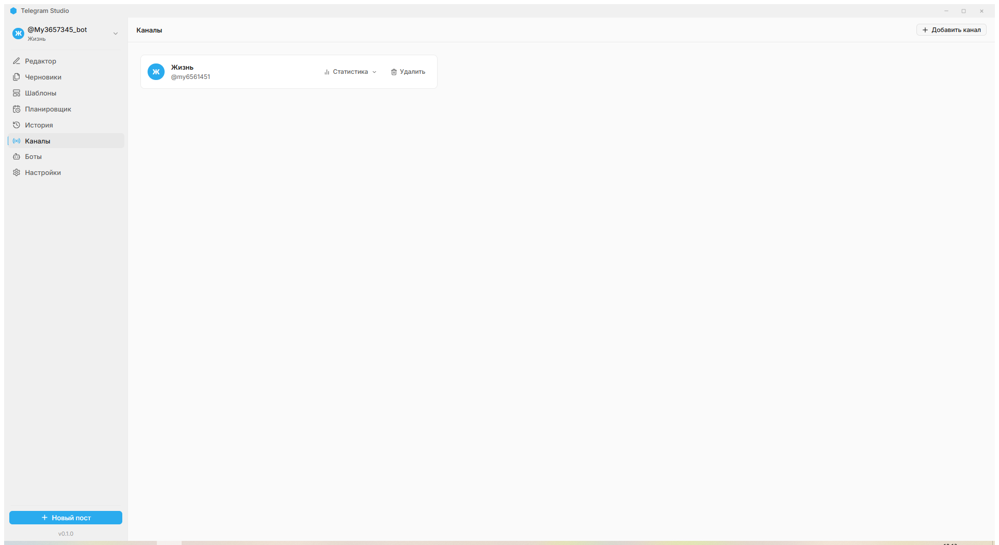
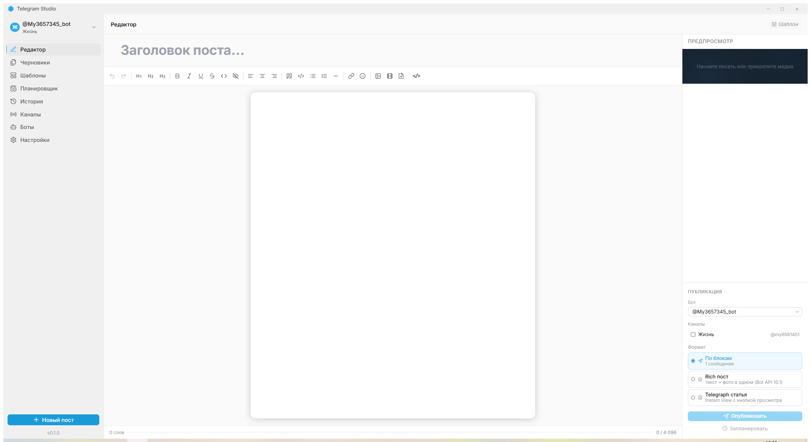
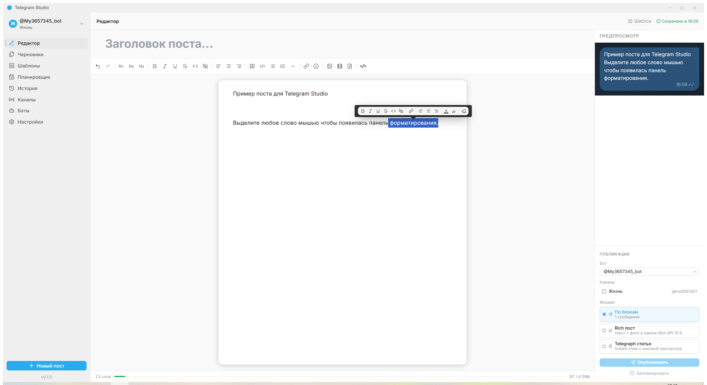
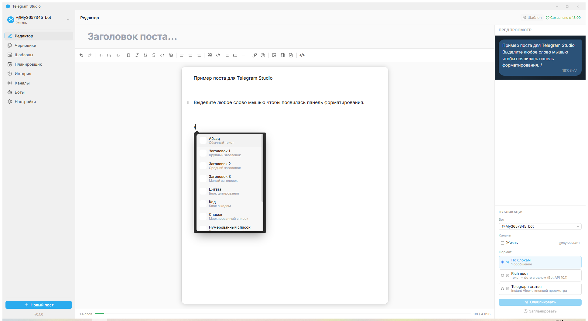
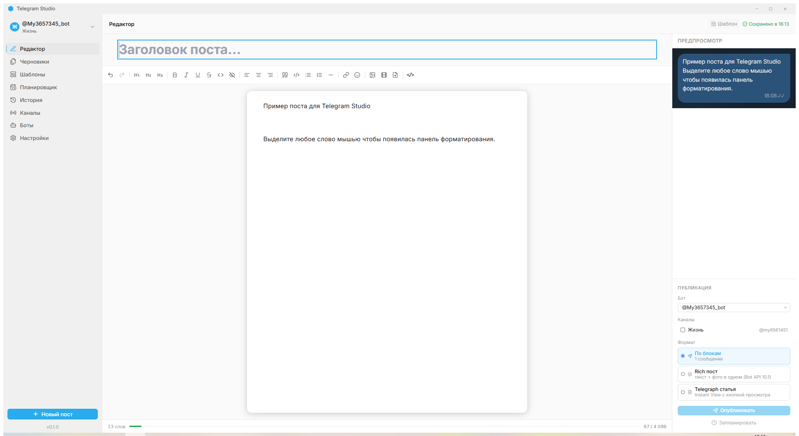

# Telegram Studio — Руководство пользователя

**Версия 0.1.0** | Июнь 2026

---

## Содержание

1. [Что такое Telegram Studio](#что-такое-telegram-studio)
2. [Установка](#установка)
3. [Первый запуск: добавление канала](#первый-запуск-добавление-канала-и-бота)
4. [Интерфейс приложения](#интерфейс-приложения)
5. [Редактор постов](#редактор-постов)
6. [Публикация](#публикация)
7. [Черновики и шаблоны](#черновики-и-шаблоны)
8. [Настройки](#настройки)
9. [Часто задаваемые вопросы](#часто-задаваемые-вопросы)

---

## Что такое Telegram Studio

Telegram Studio — настольное приложение для Windows. Оно помогает создавать красиво оформленные посты и публиковать их в Telegram-каналах прямо с компьютера.

**Главные преимущества:**
- Удобный редактор с форматированием
- Предпросмотр поста в стиле Telegram
- Планирование публикаций
- Работает полностью локально — никаких сторонних серверов, все данные только на вашем компьютере

---

## Установка

1. Запустите файл `Telegram Studio_0.1.0_x64_en-US.msi`
2. В появившемся окне нажмите **Далее** → **Установить**
3. После завершения приложение появится в меню **Пуск** и на рабочем столе

**Системные требования:** Windows 10 или новее (64-бит), ~150 МБ на диске.

---

## Первый запуск: добавление канала и бота

Прежде чем публиковать посты, нужно настроить Telegram-бота и добавить ваш канал.

### Шаг 1. Создайте Telegram-бота

1. Откройте Telegram, найдите `@BotFather` и начните диалог
2. Отправьте команду `/newbot`
3. Придумайте **имя** бота (например, `Мой Канал Бот`) и **username** (латиница, заканчивается на `bot`)
4. BotFather ответит сообщением с **токеном** — строкой вида `123456789:ABCdefGH...`

> Токен — это пароль вашего бота. Никому его не передавайте.

### Шаг 2. Добавьте бота в канал

1. Откройте ваш канал в Telegram
2. Перейдите в **Настройки канала** → **Администраторы** → **Добавить администратора**
3. Найдите своего бота по username и добавьте его
4. В правах администратора включите **Публикация сообщений**
5. Нажмите **Сохранить**

### Шаг 3. Узнайте ID канала

1. Перешлите любое сообщение из вашего канала боту `@userinfobot`
2. Бот ответит — найдите строку `Forwarded from chat id: -100XXXXXXXXX`
3. Скопируйте этот ID (он начинается с `-100`)

### Шаг 4. Добавьте канал в Telegram Studio

1. Откройте приложение и перейдите в раздел **Каналы** (боковое меню)
2. Нажмите кнопку **+ Добавить канал**
3. Заполните поля: название, токен бота, ID канала
4. Нажмите **Сохранить**

Канал появится в списке — теперь можно публиковать посты.

---

## Интерфейс приложения

### Боковое меню (слева)

| Иконка | Раздел | Назначение |
|--------|--------|-----------|
| ✏️ | Редактор | Создание нового поста |
| 📄 | Черновики | Сохранённые незавершённые посты |
| 🗓 | Планировщик | Посты с назначенной датой публикации |
| 📋 | История | Все опубликованные посты |
| 📢 | Каналы | Управление каналами |
| ⚙️ | Настройки | Тема, автосохранение, Telegraph |

### Основная область

Состоит из трёх частей:
- **Редактор** (центр) — здесь пишете и форматируете пост
- **Предпросмотр** (правая панель, вверху) — как пост выглядит в Telegram
- **Публикация** (правая панель, внизу) — выбор канала и кнопки публикации

---

## Редактор постов

### Открытие редактора

Нажмите на иконку **Редактор** (карандаш) в боковом меню или кнопку **+ Новый пост** внизу слева. Откроется чистый лист.

### Панель инструментов

Наведите на любую кнопку — появится подсказка с названием и горячей клавишей.

**Основные инструменты:**

| Кнопка | Действие | Горячая клавиша |
|--------|----------|-----------------|
| **Ж** | Жирный текст | Ctrl+B |
| *К* | Курсив | Ctrl+I |
| <u>Ч</u> | Подчёркнутый | Ctrl+U |
| ~~З~~ | Зачёркнутый | Ctrl+Shift+X |
| `М` | Моноширинный | Ctrl+E |
| 👁 | Спойлер (скрытый текст) | — |
| H1 / H2 / H3 | Заголовки | Ctrl+Shift+1/2/3 |
| ❝ | Цитата | Ctrl+Shift+B |
| 🔗 | Ссылка | Ctrl+K |
| ≡ | Выравнивание | — |
| 😊 | Эмодзи | — |
| 🖼 / 🎬 | Изображение / Видео | — |
| `</>` | Посмотреть HTML-код | — |

### Вставка блоков: команда `/`

Нажмите `/` в начале пустой строки — откроется меню выбора блоков:

Выберите блок стрелками или щёлкните мышью. Доступны: абзац, заголовки, цитата, код, списки, разделитель, изображение, видео.

### Вставка блоков: правая кнопка мыши

Щёлкните правой кнопкой в любом месте редактора — появится то же самое контекстное меню с блоками для вставки.

### Всплывающая панель форматирования

Выделите любой текст — над ним появится панель с кнопками форматирования:

Здесь можно быстро применить жирный, курсив, ссылку, цвет текста и другие стили.

### Цвет текста и выделение

В всплывающей панели нажмите иконку **A** (цвет текста) или **маркер** (выделение фона) — откроется палитра цветов для оформления текста.

### Перетаскивание блоков

Наведите курсор на любой блок — слева появится иконка перетаскивания (⠿). Зажмите её и перетащите блок на новое место.

### Вставка изображений и видео

**Через кнопку** — нажмите 🖼 или 🎬 на панели инструментов и выберите файл.

**Перетаскиванием** — перетащите файл из проводника прямо в редактор.

**Ограничения Telegram:**
- Изображения: JPG, PNG, WebP, GIF — до 10 МБ
- Видео: MP4 — до 50 МБ

### Просмотр HTML-кода

Нажмите кнопку `</>` — откроется боковая панель с HTML-кодом поста. Это полезно для проверки форматирования перед публикацией.

### Счётчик символов

В нижней части редактора отображается количество символов и слов. Лимит Telegram — **4096 символов**.

---

## Публикация

### Предпросмотр

Правая верхняя панель показывает, как пост будет выглядеть в мессенджере. Обновляется автоматически по мере набора текста.

### Немедленная публикация

1. В панели **Публикация** выберите **канал** из выпадающего списка
2. Выберите **режим поста**:
   - **По блокам** — стандартный текст Telegram (жирный, курсив, ссылки, спойлер)
   - **Rich пост** — расширенное форматирование через Telegraph (заголовки, цитаты, блоки кода)
   - **Telegraph статья** — публикуется как отдельная статья с кнопкой «Читать»
3. Нажмите кнопку **Опубликовать**

### Планирование публикации

1. Выберите канал и режим
2. Нажмите **Запланировать**
3. Укажите дату и время
4. Нажмите **Сохранить** — пост появится в разделе **Планировщик**

Приложение должно быть запущено в момент публикации.

---

## Черновики и шаблоны

### Черновики

Все посты сохраняются автоматически каждые 30 секунд (можно изменить в настройках).

Чтобы открыть сохранённый черновик: перейдите в раздел **Черновики** → нажмите на нужный пост.

Ручное сохранение: нажмите **Ctrl+S** в редакторе.

### Шаблоны

Сохраните текущий пост как шаблон: нажмите кнопку **Шаблон** в верхней панели редактора.

Шаблоны хранятся постоянно и доступны при создании новых постов.

---

## Настройки

### Оформление

Выберите тему оформления: **Светлая**, **Тёмная** или **Системная** (приложение следует за настройками Windows).

### Редактор

Настройки автосохранения черновиков: интервал (в секундах) или отключение.

### Telegraph (для насыщенных постов)

Для публикации насыщенных постов нужно войти в Telegraph:

1. Перейдите в **Настройки** → **Telegraph**
2. Нажмите **Войти через Telegram**
3. Следуйте инструкции на экране

---

## Часто задаваемые вопросы

**Пост не публикуется. Что делать?**
- Убедитесь, что бот добавлен в канал как администратор с правом **Публикации сообщений**
- Проверьте токен — скопируйте его заново из BotFather без лишних пробелов
- Проверьте ID канала — он должен начинаться с `-100`

**Не могу добавить видео — ошибка размера.**  
Telegram принимает видео до 50 МБ в формате MP4. Сжмите видео или обрежьте лишние части.

**Где хранятся мои данные?**  
Все данные (черновики, каналы, история) хранятся только на вашем компьютере:  
`%APPDATA%\com.telegram-studio\telegram-studio.db`

**Приложение не запускается.**  
- Убедитесь, что Windows 10 64-бит или новее
- Запустите установщик ещё раз и выберите **Восстановить**

**Что такое насыщенный пост?**  
Насыщенный (Rich) пост публикуется через Telegraph — отдельный сервис от создателей Telegram. Он поддерживает заголовки, цитаты, блоки кода и полное HTML-форматирование. Обычный пост — просто текст в Telegram с базовым форматированием.

**Могу ли я публиковать в несколько каналов одновременно?**  
В текущей версии — нет. Вы выбираете один канал перед публикацией.

**Приложение просит войти в Telegraph, хотя я не нажимал Rich пост.**  
Telegraph нужен только для режима **Rich пост** и **Telegraph статья**. Для обычных постов по блокам Telegraph не нужен.

---

*Telegram Studio v0.1.0 · Локальное приложение, без серверов, без подписки*
