# Telegram Studio — Руководство пользователя

**Версия 1.8.4**

---

## Содержание

1. [Что такое Telegram Studio](#что-такое-telegram-studio)
2. [Установка и активация лицензии](#установка-и-активация-лицензии)
3. [Первый запуск: бот и канал](#первый-запуск-бот-и-канал)
4. [Интерфейс приложения](#интерфейс-приложения)
5. [Редактор постов: блочная система](#редактор-постов-блочная-система)
6. [Публикация](#публикация)
7. [Планирование](#планирование)
8. [Черновики и шаблоны](#черновики-и-шаблоны)
9. [История публикаций](#история-публикаций)
10. [Настройки](#настройки)
11. [Часто задаваемые вопросы](#часто-задаваемые-вопросы)

---

## Что такое Telegram Studio

Telegram Studio — десктопное приложение для создания и публикации постов в Telegram-каналах. Не сайт, не веб-сервис — обычная программа, которая работает на вашем компьютере.

**Главные особенности:**
- Блочный редактор постов — как в Notion, только заточен под то, что реально поддерживает Telegram
- Живой предпросмотр — пост выглядит в редакторе точно так же, как придёт подписчикам
- Публикация сразу в несколько каналов одним нажатием
- Планирование публикаций на конкретную дату и время
- Два режима постов: обычный (стандартные сообщения Telegram) и Rich (расширенное форматирование — таблицы, коллажи, карты, формулы)
- Работает полностью локально — нет ни сервера, ни аналитики, ни доступа к вашим данным со стороны; вся база данных, черновики и настройки хранятся только на вашем компьютере
- Один раз купили — программа остаётся с вами, без подписки

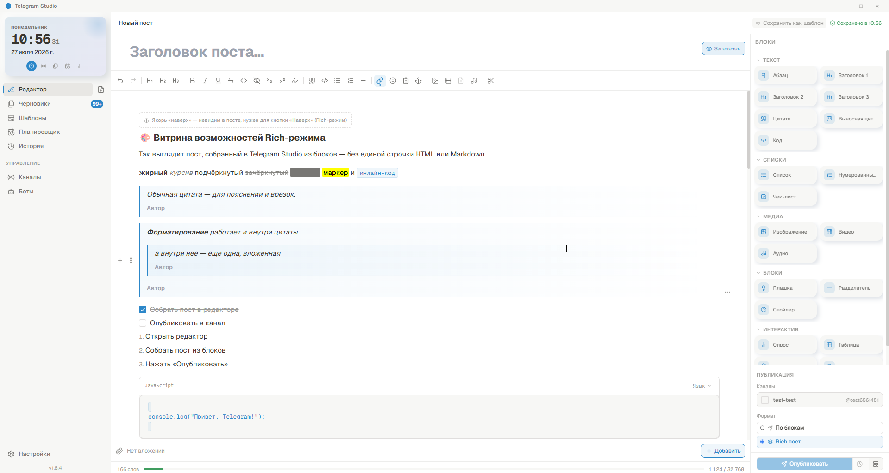

---

## Установка и активация лицензии

### Установка

1. Скачайте установщик (`Telegram Studio_<версия>_x64.msi` — на Windows). После покупки его присылает бот вместе с ключом активации.
2. Запустите файл, нажмите **Далее** → **Установить**.
3. После завершения приложение появится в меню **Пуск**.

**Системные требования (Windows):** Windows 10 или новее, 64-бит, ~150 МБ на диске.

### Активация

При первом запуске приложение попросит ввести **ключ активации** — 16-символьный код, полученный от бота-продавца после покупки.

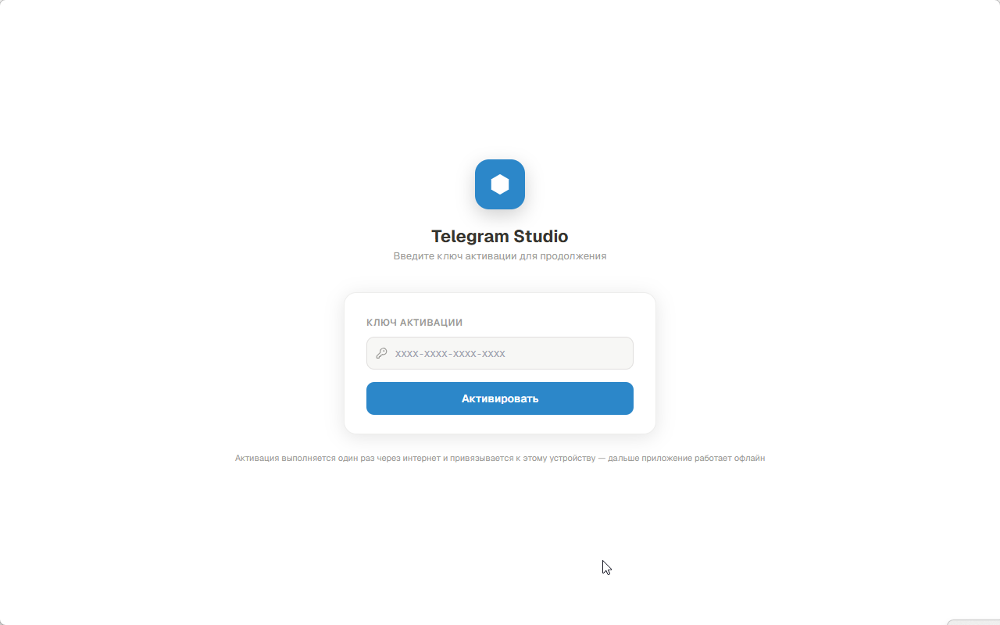

1. Вставьте ключ в поле (дефисы можно не убирать вручную — они подставятся сами)
2. Нажмите **Активировать**

Активация выполняется **один раз через интернет** и привязывается к этому компьютеру — дальше приложение работает полностью офлайн, без повторных проверок. Если вы переустановите Windows на том же компьютере, тот же ключ снова сработает. На другом компьютере тем же ключом активироваться уже не получится — один ключ = одна машина.

Если ключ был утерян — его всегда можно запросить у бота-продавца ещё раз (команда или кнопка «Мой ключ»).

---

## Первый запуск: бот и канал

При первом запуске (сразу после активации лицензии) приложение само проводит через короткий мастер настройки из трёх шагов: **Бот → Канал → Готово**. Всё, что нужно сделать заранее в самом Telegram — два действия ниже, дальше мастер всё подставит сам.

### Шаг 1. Создайте Telegram-бота

1. Откройте Telegram, найдите `@BotFather` и начните диалог
2. Отправьте команду `/newbot`
3. Придумайте **имя** бота и **username** (латиница, заканчивается на `bot`)
4. BotFather пришлёт **токен** — строку вида `123456789:ABCdefGH...`

> Токен — это пароль вашего бота. Никому его не передавайте. Токен хранится на вашем компьютере в зашифрованном виде и никогда никуда не отправляется, кроме самого Telegram.

### Шаг 2. Добавьте бота в канал

1. Откройте ваш канал в Telegram
2. **Настройки канала** → **Администраторы** → **Добавить администратора**
3. Найдите бота по username, добавьте его
4. Включите право **Публикация сообщений**, сохраните

### Шаг 3. Пройдите мастер в приложении

Мастер открывается автоматически и просит те же данные по порядку:

**«Бот»** — вставьте токен, полученный от BotFather, и нажмите **Подключить бота**.

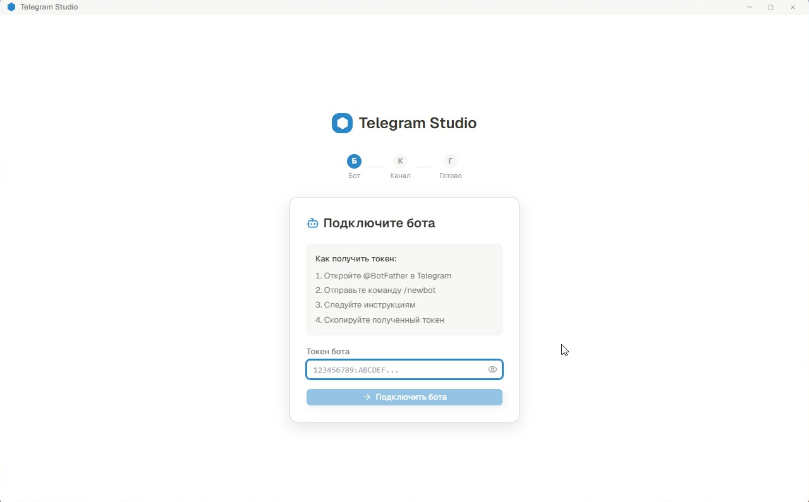

**«Канал»** — введите `@username` канала (если он публичный, этого достаточно) или его числовой ID.

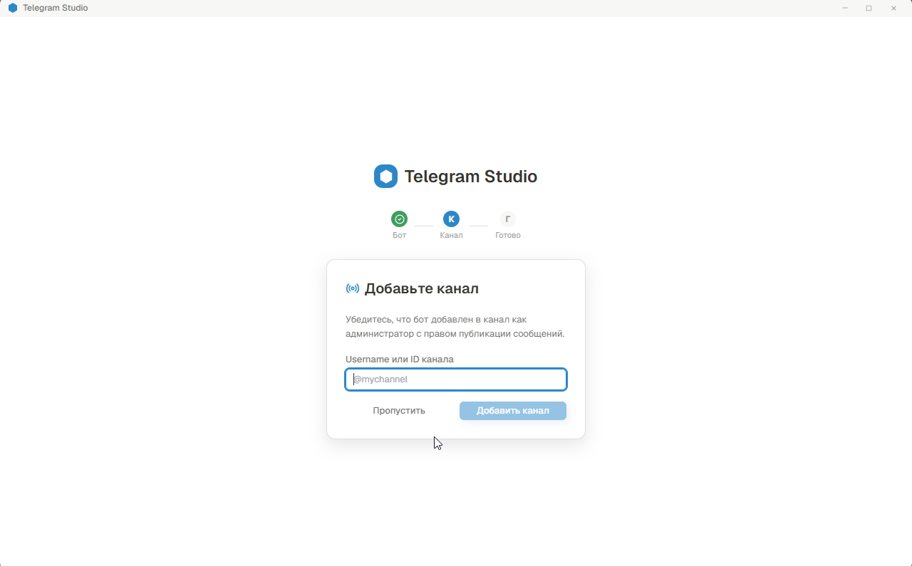

> Если у канала нет публичного username — узнать ID можно, переслав любое сообщение из канала боту `@userinfobot`: в ответе будет строка `Forwarded from chat id: -100XXXXXXXXX`, это и есть ID.

**«Готово»** — мастер подтверждает, что всё настроено, и предлагает сразу перейти к редактору.

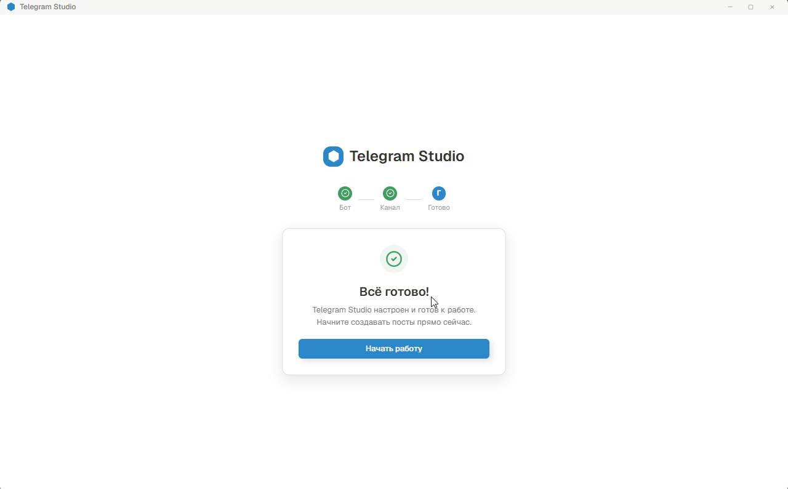

### Добавление ещё одного бота или канала

Мастер проходится один раз при первом запуске. Чтобы подключить дополнительного бота или ещё один канал позже — это делается вручную через боковое меню:

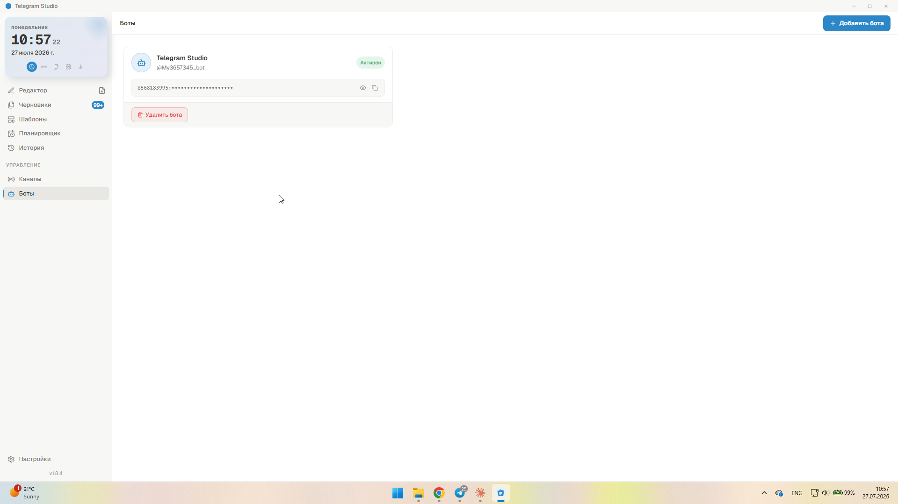

Раздел **Боты** → добавьте токен; раздел **Каналы** → **+ Добавить канал** → название, выбор бота, username или ID канала → **Сохранить**.

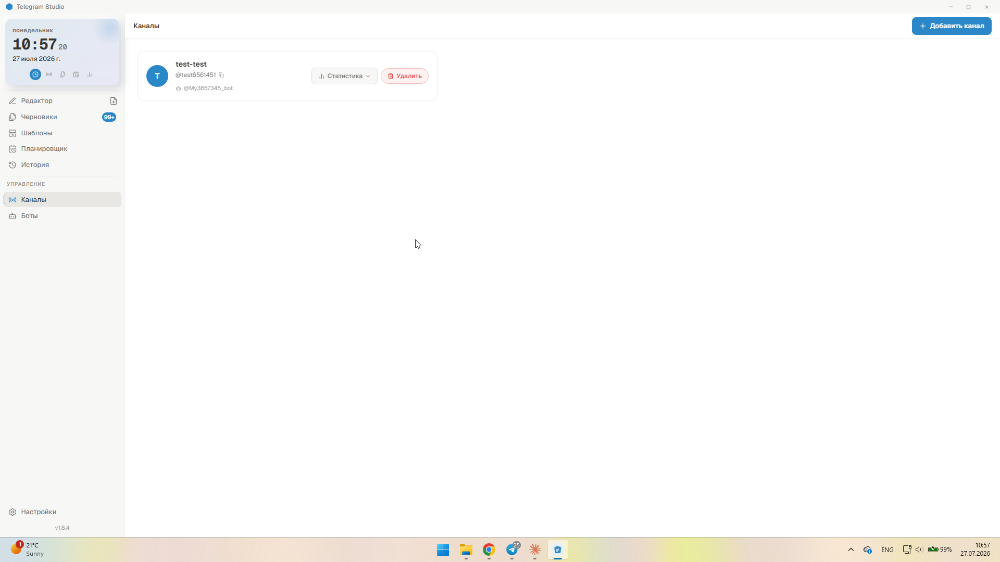

---

## Интерфейс приложения

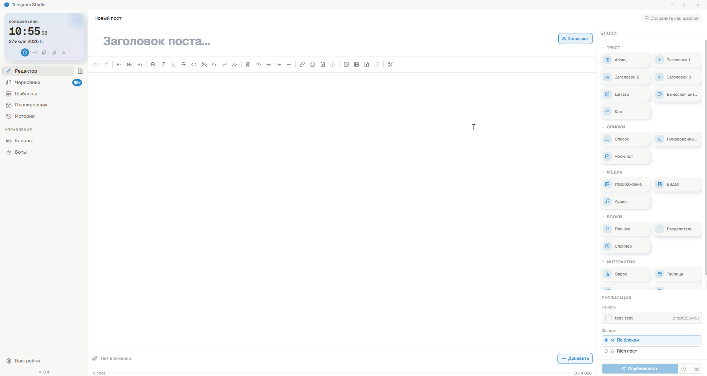

### Боковое меню

| Раздел | Назначение |
|--------|-----------|
| Редактор | Создание нового поста |
| Черновики | Незавершённые посты, автосохранённые |
| Шаблоны | Заготовки постов для повторного использования |
| Планировщик | Календарь с запланированными публикациями |
| История | Все опубликованные посты и статус их отправки |
| Каналы | Управление подключёнными каналами |
| Боты | Управление токенами ботов |
| Настройки | Тема, язык, автосохранение, публикация |

### Основная область редактора

- **Панель блоков** (слева) — список всех типов блоков для перетаскивания в пост
- **Редактор** (центр) — сам текст поста
- **Предпросмотр** (справа, вверху) — как пост будет выглядеть в Telegram, обновляется на лету
- **Публикация** (справа, внизу) — выбор каналов, режима и кнопки отправки

---

## Редактор постов: блочная система

Пост в Telegram Studio собирается не как один сплошной текст, а из отдельных **блоков** — заголовок, абзац, изображение, таблица и так далее. Каждый блок — самостоятельный кусок контента, который можно независимо перетаскивать, удалять, менять местами или превращать в блок другого типа.

### Как вставить блок

**Способ 1 — панель блоков слева.** Показывает все доступные блоки. Наведите на нужный и либо кликните (блок добавится в конец поста), либо перетащите его мышью прямо в нужное место документа — курсор покажет линию-подсказку, куда именно он встанет.

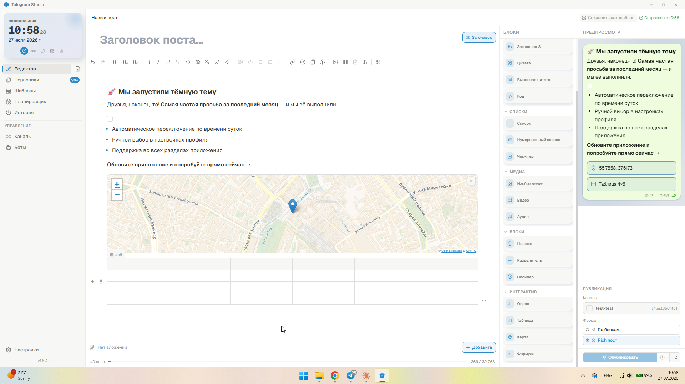

**Способ 2 — команда `/`.** Наберите `/` в начале пустой строки — откроется тот же список блоков с поиском по названию, только всплывающим окном прямо у курсора.

**Способ 3 — правая кнопка мыши.** Правый клик в любом месте редактора открывает то же меню вставки/управления блоками.

### Управление уже вставленным блоком

Наведите курсор на блок — слева появится ручка перетаскивания (⠿), справа — кнопка «⋯» с меню действий (дублировать, удалить, превратить в другой тип блока, разделить пост в этом месте).

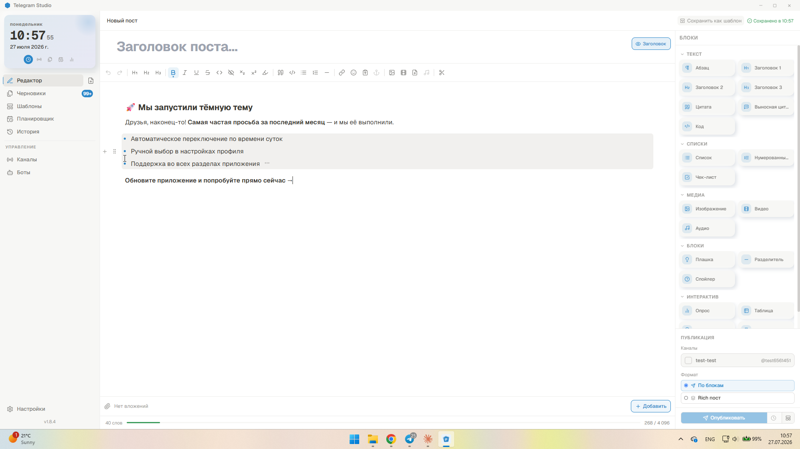

Блок также можно передвинуть с клавиатуры: `Ctrl+Shift+↑` / `Ctrl+Shift+↓` (курсор внутри блока).

### Полный список блоков

| Блок | Что делает | Доступность |
|------|-----------|-------------|
| Абзац | Обычный текст | везде |
| Заголовок 1 / 2 / 3 | Заголовки трёх уровней | везде (в обычном режиме выглядит как жирный текст) |
| Цитата | Блок цитирования, можно добавить подпись автора | везде |
| Выносная цитата | Крупная центрированная цитата с подписью — для акцентных высказываний | только Rich |
| Код | Блок кода с подсветкой | везде |
| Список / Нумерованный список | Маркированный и нумерованный списки | везде |
| Чек-лист | Пункты с флажками | везде |
| Плашка (callout) | Выделенный блок с эмодзи-иконкой — для примечаний | везде |
| Спойлер | Сворачиваемый блок «вопрос — ответ» | везде |
| Разделитель | Горизонтальная линия | везде |
| Изображение / Видео | Вставка фото или видео (кнопкой, слэш-командой или просто перетащите файл из проводника) | везде |
| Аудио | Аудиофайл с плеером прямо в посте | только Rich |
| Файл | Произвольный документ вложением | только обычный режим |
| Таблица | Сетка с настраиваемым числом строк и столбцов | только Rich |
| Опрос | Голосование с вариантами ответов | только обычный режим |
| Карта | Точка на карте (адрес/событие) | только Rich |
| Формула | Математическая формула (LaTeX) | только Rich |

Если блок недоступен в текущем режиме публикации — приложение покажет предупреждение прямо на месте вставки со ссылкой переключиться в нужный режим.

### Несколько фото/видео подряд

Если поставить два и больше изображения или видео рядом, в Rich-режиме они автоматически объединяются в группу — коллаж (сеткой) или слайд-шоу (пролистыванием). Переключить вид группы можно небольшой кнопкой-переключателем, которая появляется на самих блоках.

### Якорь «Лифт»

В Rich-режиме для длинных постов доступна ссылка мгновенного перехода в начало текста (кнопка «Лифт» в панели инструментов) — удобно, когда пост длинный и подписчику нужно быстро вернуться наверх.

### Форматирование текста

Выделите текст — появится всплывающая панель: жирный, курсив, подчёркивание, зачёркивание, моноширинный текст, спойлер, ссылка, цвет текста, выделение маркером.

Панель инструментов сверху редактора дублирует основные действия и добавляет: заголовки, цитату, списки, разделитель, эмодзи, сниппеты (заготовки часто используемого текста), вставку изображения/видео/аудио/файла, ручной разрыв поста на несколько сообщений (кнопка «Разделить пост здесь»).

### Обычный режим vs Rich-режим

Переключатель режима — в панели публикации справа.

- **Обычный («По блокам»)** — стандартное сообщение Telegram: жирный/курсив/подчёркивание/спойлер/ссылки, простые списки, фото/видео/файлы/опросы. Лимит **4096 символов** (или **1024**, если в посте есть медиа — это ограничение самого Telegram, не приложения).
- **Rich** — расширенное форматирование через `sendRichMessage` (Bot API 10.1+): настоящие заголовки, таблицы, вложенные цитаты, коллажи/слайд-шоу, аудио, карты, формулы, чек-листы с реальными чекбоксами. Лимит **32 768 символов**, независимо от наличия медиа. Файлы и опросы в этом режиме не поддерживаются Telegram.

### Счётчик символов

Внизу редактора — количество символов и лимит для текущего режима. При превышении лимита показывается, где именно пост будет автоматически разбит на несколько сообщений.

---

## Публикация

### Предпросмотр

Правая верхняя панель показывает пост в стиле Telegram, обновляется по мере набора текста.

### Немедленная публикация

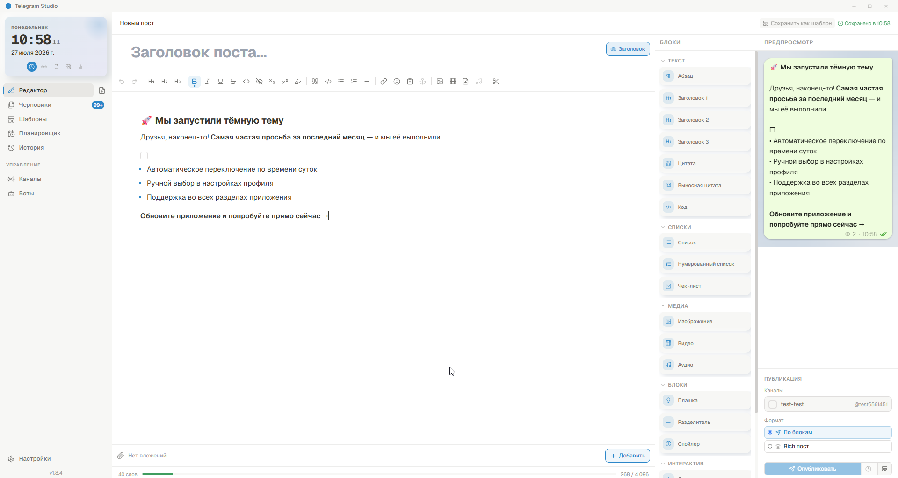

1. В панели **Публикация** отметьте галочками один или несколько **каналов** — можно опубликовать сразу во все нужные одним нажатием
2. Выберите **режим**: По блокам или Rich
3. Нажмите **Опубликовать**

Если пост не помещается в лимит режима — приложение сначала предложит посмотреть, где пройдёт разрыв на несколько сообщений, разрыв можно поставить и вручную в нужном месте.

### Планирование публикации

1. Выберите каналы и режим
2. Нажмите **Запланировать**, укажите дату и время
3. Пост появится в разделе **Планировщик**

Приложение должно быть запущено в момент публикации — именно оно, а не облако, отправляет пост в назначенное время.

---

## Планирование

Раздел **Планировщик** — календарь всех запланированных публикаций. У каждой карточки виден канал, время и статус (ожидает / запланировано / опубликовано). Запланированную публикацию можно отменить прямо из списка кнопкой отмены.

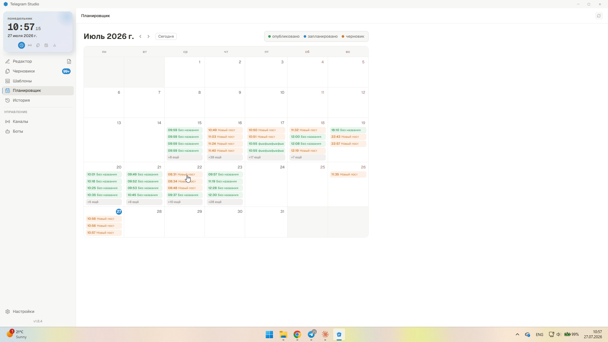

---

## Черновики и шаблоны

### Черновики

Пост сохраняется автоматически (интервал настраивается в Настройках → Редактор). Открыть сохранённый черновик: раздел **Черновики** → клик по посту. Ручное сохранение — `Ctrl+S`.

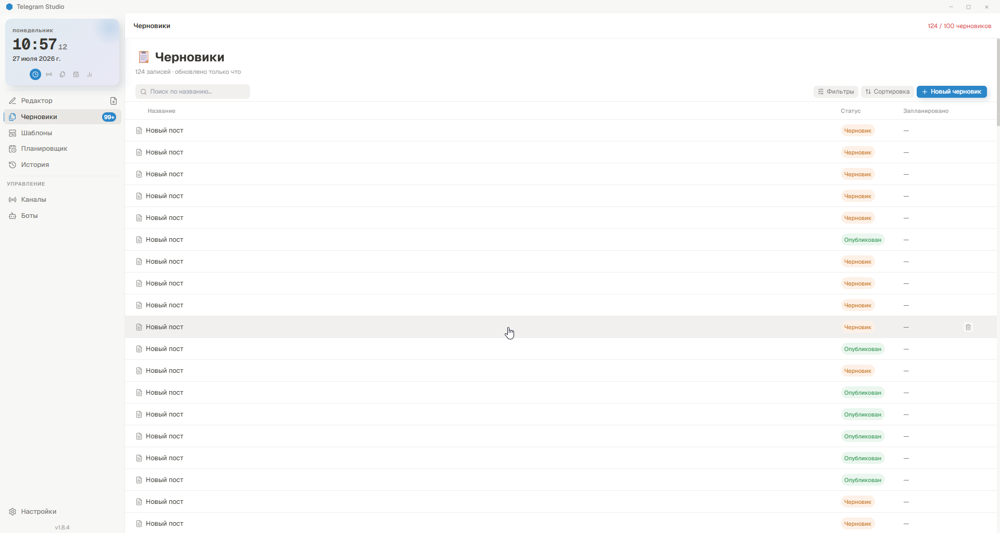

### Шаблоны

Разница простая: черновик — незаконченный пост, шаблон — заготовка-фабрика для новых постов. Сохранить текущий пост как шаблон можно кнопкой **Шаблон** в панели редактора; шаблоны хранятся в отдельном разделе **Шаблоны**, можно распределять по категориям. При использовании шаблона его содержимое копируется в новый черновик — сам шаблон при этом не меняется. В разделе уже есть несколько готовых примеров для старта.

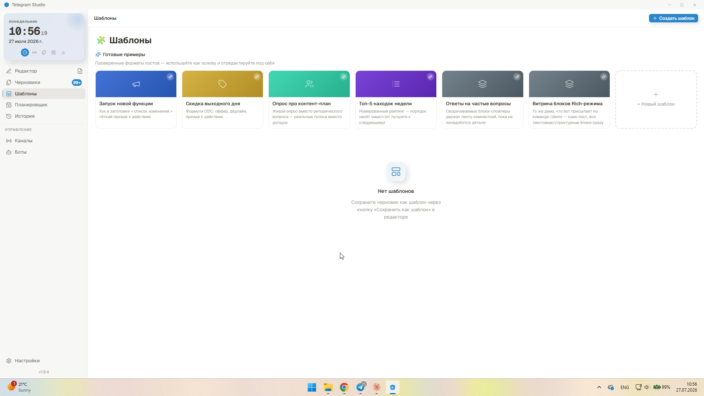

---

## История публикаций

Раздел **История** показывает все отправленные посты и результат отправки по каждому каналу.

- **Редактировать уже опубликованный пост** — доступно для обычного режима (кнопка «Редактировать пост»), Telegram позволяет менять текст уже отправленного сообщения. Rich-посты после публикации редактировать нельзя — так устроен сам Bot API.
- **Отложенное удаление** — можно поставить автоматическое удаление поста через 1/6/24/48 часов после публикации, с возможностью отменить, пока время не наступило.

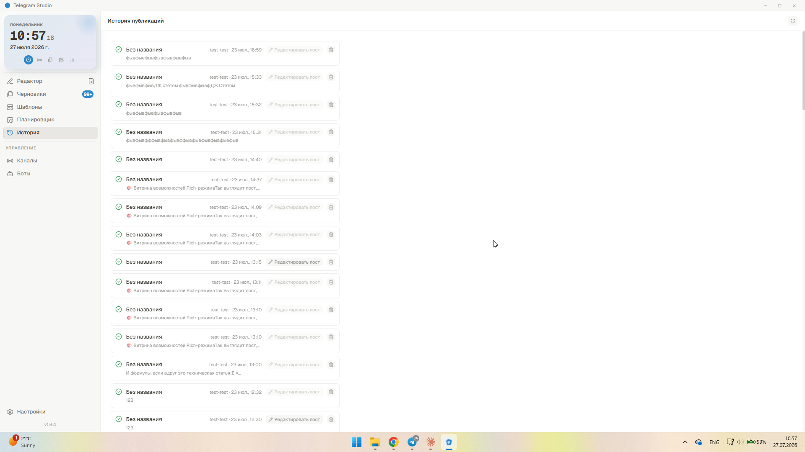

Раздел **Каналы** также показывает дашборд по каждому каналу — число подписчиков и статистику публикаций.

---

## Настройки

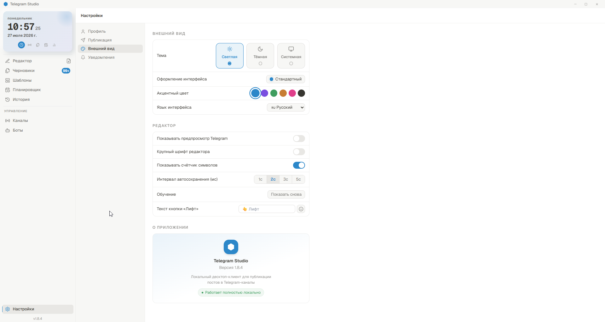

Настройки разбиты на вкладки: **Профиль**, **Боты и токены**, **Каналы**, **Публикация**, **Внешний вид**, **Уведомления** (пока заглушка — появится в одной из следующих версий).

### Внешний вид

- Тема: светлая / тёмная / системная (следует за темой Windows)
- Оформление интерфейса: стандартное или «Мягкая структура» (мягкие неоморфные тени; в этом варианте доступна только светлая тема)
- Акцентный цвет, компактный режим, крупный шрифт редактора
- **Язык интерфейса** — русский, английский, французский, польский, испанский

### Редактор

- Показывать счётчик символов
- Интервал автосохранения черновиков (в миллисекундах)
- Текст кнопки «Лифт» (можно переименовать, вставить эмодзи)
- Повторно показать обучающий тур по интерфейсу

### Публикация

- Подтверждать перед публикацией (диалог с последней проверкой перед отправкой)

---

## Часто задаваемые вопросы

**Пост не публикуется. Что делать?**
- Убедитесь, что бот добавлен в канал как администратор с правом **Публикации сообщений**
- Проверьте токен — скопируйте его заново из BotFather без лишних пробелов
- Проверьте ID канала — должен начинаться с `-100`

**Ключ активации не подходит / просит активацию заново после обновления.**
Ключ привязан к конкретному компьютеру, а не к версии приложения — обновление программы не требует повторной активации. Если всё же просит — попробуйте ввести тот же ключ ещё раз, приложение само подхватит существующую привязку. Если не помогло — напишите в поддержку через бота.

**В чём разница между обычным режимом и Rich?**
Обычный — стандартное сообщение Telegram с базовым форматированием, лимит 4096/1024 символа. Rich — расширенное форматирование (таблицы, коллажи, карты, формулы, настоящие заголовки), лимит 32 768 символов, но без файлов и опросов.

**Могу ли я публиковать сразу в несколько каналов?**
Да — отметьте нужные каналы галочками в панели публикации, пост уйдёт во все выбранные одним нажатием.

**Не могу добавить видео — ошибка размера.**
Telegram принимает видео до 50 МБ. Сожмите видео или обрежьте лишнее — приложение также умеет автоматически сжимать крупные изображения перед отправкой.

**Где хранятся мои данные?**
Всё — черновики, каналы, история, токены ботов — хранится только на вашем компьютере, в зашифрованном виде для чувствительных данных:
`%APPDATA%\com.telegram-studio.app\telegram-studio.db`

**Приложение не запускается.**
- Убедитесь, что Windows 10 64-бит или новее
- Запустите установщик ещё раз и выберите **Восстановить**

**Есть версия не для Windows?**
Приложение основано на Tauri и в перспективе доступно и на других платформах (в том числе есть рабочий порт под Android) — уточняйте актуальную доступность у продавца.

---

*Telegram Studio v1.8.4 · Локальное приложение, без серверов, без подписки*
